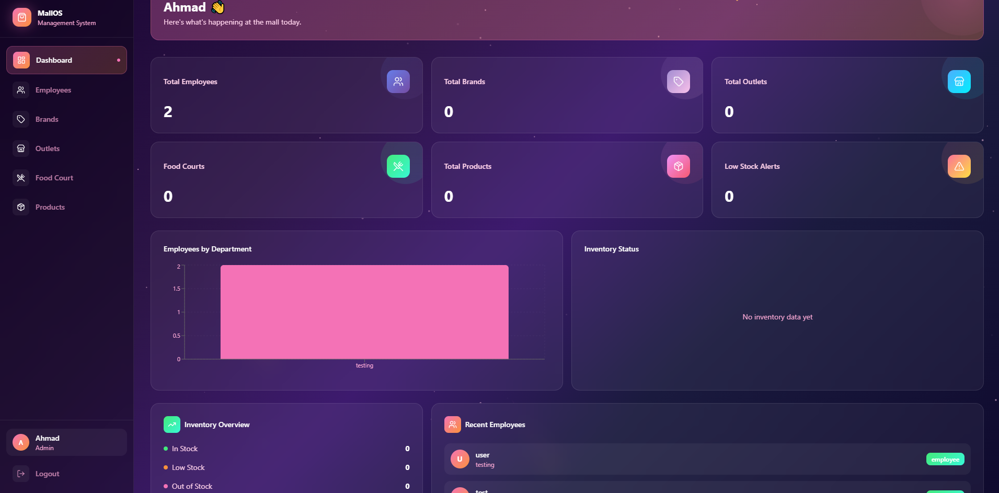

# Mall Management System

A full-stack Mall Management System built with the MERN stack and PostgreSQL.

## Tech Stack

- **Frontend:** React.js, Redux Toolkit, Tailwind CSS, React Router v6
- **Backend:** Node.js, Express.js
- **Database:** PostgreSQL
- **Authentication:** JWT + Role-Based Access Control
- **AI:** OpenAI GPT-3.5 for smart dashboard summaries

## Modules

1. Dashboard & Analytics (with AI Smart Summary)
2. Employee Management
3. Brands & Brand Chains
4. Outlet / Branch Network
5. Food Court Management
6. Product & Inventory Management

## Roles

| Role | Access |
|------|--------|
| Admin | Full access |
| Manager | Read + Update |
| Employee | Read only |

## Setup Instructions

### Prerequisites
- Node.js v18+
- PostgreSQL 17
- OpenAI API Key

### Backend Setup
```bash
cd server
npm install
cp .env.example .env
# Fill in your .env values
npm run dev
```

### Frontend Setup
```bash
cd client
npm install
npm run dev
```

### Database Setup
Connect to PostgreSQL and create the database:
```sql
CREATE DATABASE mall_management;
```
Then run the SQL migrations from `database/migrations/`.

## API Endpoints

### Auth
- `POST /api/auth/register`
- `POST /api/auth/login`
- `GET /api/auth/me`

### Employees
- `GET /api/employees`
- `POST /api/employees`
- `PATCH /api/employees/:id`
- `DELETE /api/employees/:id`

### Brands
- `GET /api/brands`
- `POST /api/brands`
- `PATCH /api/brands/:id`
- `DELETE /api/brands/:id`

### Outlets
- `GET /api/outlets`
- `POST /api/outlets`
- `PATCH /api/outlets/:id`
- `DELETE /api/outlets/:id`

### Food Court
- `GET /api/foodcourt`
- `POST /api/foodcourt`
- `PATCH /api/foodcourt/:id`
- `DELETE /api/foodcourt/:id`

### Products
- `GET /api/products`
- `POST /api/products`
- `PATCH /api/products/:id`
- `DELETE /api/products/:id`

### Dashboard
- `GET /api/dashboard/stats`
- `GET /api/dashboard/recent-activity`
- `GET /api/dashboard/inventory-overview`
- `GET /api/dashboard/ai-summary`

## Screenshots



## Author

Developed for U Devs Hackathon 2026